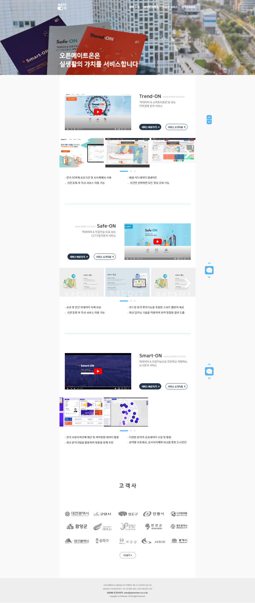
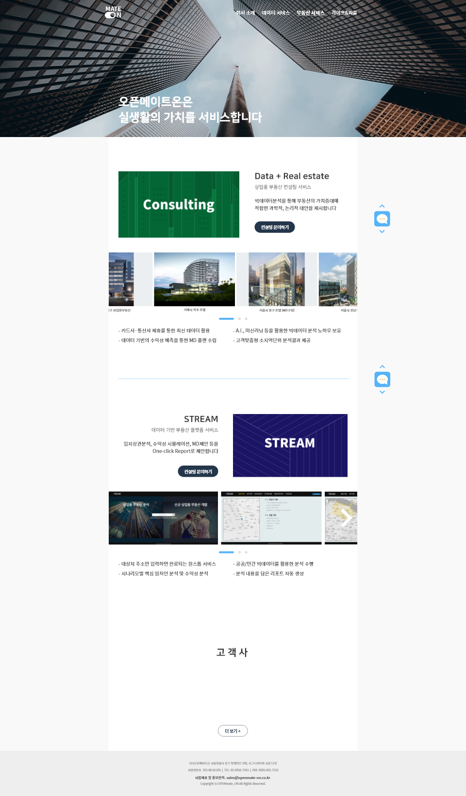
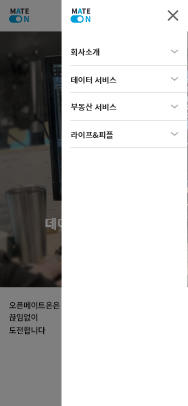
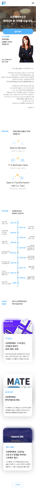
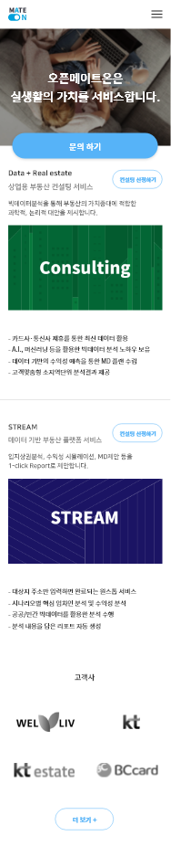
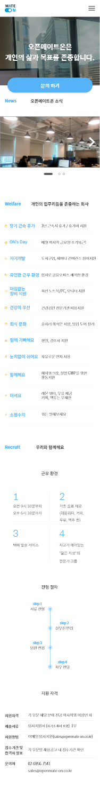

# <a href="https://openmate-on.co.kr" target="_blank">openmateon</a>-homepage

## 프로젝트 시작하게 된 동기

### 모회사 오픈메이트에서 자회사 오픈메이트온이 법인 분리되고나서 해당 회사에서는 홈페이지가 급하게 필요했다. 그래서 디자인 시안 1명 + 개발자 1명이 총 2주에 걸쳐서 빠르게 결과물을 내기를 원했고, 그 개발자는 내가 되었다.

<br/><br/>

## 시스템 구성환경

### 시스템 구성환경은 아래와 같다. 한창 VueJS로 프로젝트들을 진행해서 이번 홈페이지 개발에도 적용시키려 하였으나, 사이즈가 상대적으로 너무 작았고, 빠르게 구현을 해야하기에 javascript와 jQuery 범위안에서 해결했다. 퍼블리싱을 포함한 FE영역 배포과정을 전반적으로 다 진행했지만, 규모가 작아서 그런지 큰 어려움없이 작업을 했다.

<br/><br/>

|    유형    |             스택             | 참여(율) |
| :--------: | :--------------------------: | -------- |
| `Frontend` | HTML5, javascript(es6), css3 | O(100%)  |
| `Library`  |            jQuery            |          |

### Desc: Homepage layout with SPA structure with pure JavaScript and JQuery

### 디자인 시안 제외 참여율 100% 개발

<br/><br/>

## 기능

1. 순수 javascript로 SPA 구현
2. 다양한 해상도 및 모바일 지원을 위하여 Media-Query 채택

<br/><br/>

## 환경세팅

```bash
git clone https://github.com/Hulkong/homepage-layout.git
cd ./homepage-layout
```

<br/><br/>

## 실제 화면

### <p align="center">**WEB**</p>

  
  
  
  

<br/><br/>

### <p align="center">**MOBILE**</p>

<p align="center"></p>
<p align="center"></p>
<p align="center"></p>
<p align="center"></p>
<p align="center"></p>
<p align="center"></p>
